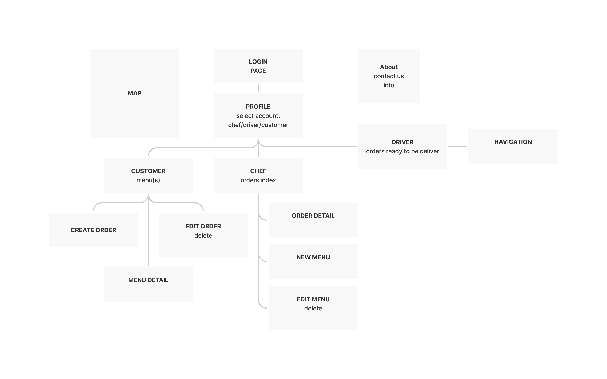

# HomeChef-FE

### Summary

HomeChef is a food delivery application. Providing a platform for users who want to start their own business, or perhaps just want to grab a bite from your local chef. 

Advertise yourself here! Not only can you list all your favorite dishes, but you can link all other social media platforms here. Link your accounts and start earning!

### Technologies 

- MERN Stack: Mongo, Express, React and Node
- HTML, CSS, SASS, Javascript
- Deployed ...
- React-Bootstrap, Iconify
- dotenv

### User Stories
- User can create a chef account and add items to their menu
- User can update and remove items from their menu
- User can add items to their cart and place an order
- Chef can update status of the order

### Entity Relationship Diagram

### SiteMap 

### Wireframes - mobile TBD

### Future Implementations
- User can create a delivery account
- User can filter items by ratings or by tags
- Google API
- PayPal API 
- And much more! 